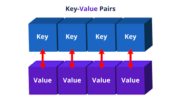
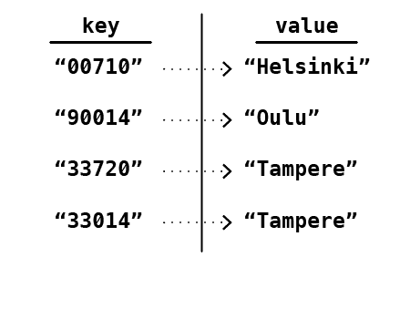

# **HashMap in Algorithms and Data Structures**

## **Overview**
The `HashMap` is a commonly used data structure in computer science and software engineering due to its efficiency and simplicity. It provides a way to store and retrieve data using a key-value pair system, enabling constant time complexity \(O(1)\) for most operations such as insertion, deletion, and lookup (in ideal cases).

---

## **What is a HashMap?**
A `HashMap` is a part of Java's `java.util` package and is an implementation of the `Map` interface. It stores elements in a hash table, where the data is organized using a hash function.

### Key Characteristics:
- **Key-Value Pair Storage**: Data is stored as a pair of keys and values.
- **Hashing**: Keys are hashed using a hash function, which determines where they will be stored in memory.
- **Non-Sorted**: Elements in a `HashMap` are not stored in a specific order.
- **Allows Nulls**: It permits one `null` key and multiple `null` values.

---

## **Applications of HashMap in Algorithms**

### 1. **Fast Data Lookup**
   - Efficiently retrieves data using a key.
   - Example: Implementing a dictionary for word definitions or a phone book for contact numbers.

### 2. **Frequency Counting**
   - Used to count the occurrence of elements in a dataset.
   - Example: Find the most frequent number in an array.

### 3. **Caching**
   - Temporary storage for frequently accessed data.
   - Example: Memoization in dynamic programming.

### 4. **Graph Representation**
   - Represents adjacency lists for graphs.
   - Example: Store edges and weights in a graph.

### 5. **Detecting Duplicates**
   - Quickly determine if duplicates exist in a dataset.
   - Example: Identify duplicate emails in a list.

---

## **Advantages of HashMap**
- **Fast Access**: \(O(1)\) time complexity for basic operations like `get` and `put`.
- **Flexible Storage**: Allows various data types as keys and values.
- **Scalable**: Performs efficiently with large datasets.

---

## **Limitations of HashMap**
- **Collision Handling**: Multiple keys may hash to the same location, requiring resolution strategies like chaining or open addressing.
- **Non-Thread-Safe**: By default, `HashMap` is not synchronized, so it requires additional mechanisms in multi-threaded environments (e.g., `ConcurrentHashMap`).
- **Unordered**: Does not maintain the order of insertion.

---

## **HashMap vs Other Data Structures**
| Feature                | HashMap            | TreeMap           | LinkedHashMap       |
|------------------------|--------------------|-------------------|---------------------|
| **Order Maintained**   | No                 | Sorted by key     | Insertion order     |
| **Null Keys Allowed**  | Yes (1 key)        | No                | Yes (1 key)         |
| **Performance**        | \(O(1)\)           | \(O(\log n)\)     | \(O(1)\)            |

---

## **Key Takeaways**
1. **Efficiency**: `HashMap` is highly efficient for problems involving fast data lookup and storage.
2. **Use Cases**: Ideal for frequency counting, caching, and adjacency list representation.
3. **Caveats**: Requires careful handling of collisions and thread safety.